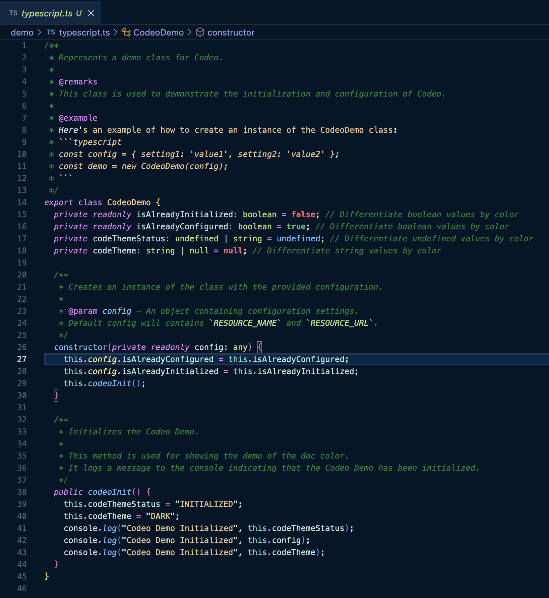

<p align="left">
    
    <h1 align="left">Codeo</h1>
</p>


[](https://vscode.dev/theme/JithinVijayan.codeo)

Fuel your late-night coding sessions with **Codeo**, a meticulously crafted Visual Studio Code theme designed to boost productivity and reduce eye strain. Perfect for developers who value accessibility, Codeo’s vibrant yet balanced color palette ensures readability for everyone.

Key features:

- ✨ Optimized for low-light environments to keep you coding comfortably through the night.
- ✨ Thoughtfully designed contrasts for enhanced focus and reading comprehension.
- ✨ A touch of style with colors that dazzle without overwhelming.

Let **Codeo** light up your editor with a theme that’s as functional as it is beautiful. 🌙💻

# Codeo



# Installation

1.  Install [Visual Studio Code](https://code.visualstudio.com/)
2.  Launch Visual Studio Code
3.  Choose **Extensions** from menu
4.  Search for `codeo`
5.  Click **Install** to install it
6.  Click **Reload** to reload the Code
7.  From the menu bar click: Code > Preferences > Color Theme > **Codeo**

## Disable Italics

If you wish to disable italics, there is now a no-italic theme available. You will have access to both, select **Codeo No Italics** as your color theme.

## Separate the Editor from the Sidebar

This theme use contrast sparingly, which makes its application more effective. This method reduces visual noise while improving your ability to skim content efficiently. However, some design choices may not be to everyone's liking.

The separation of the editor and the sidebar, as well as the level of contrast, are frequently criticized. You can make this divide more visually distinct by customizing it. Simply copy and paste the following values into your user preferences. Feel free to customize the colors according on your needs. ☺️.

```
"workbench.colorCustomizations": {
  "[Codeo]": {
    "activityBar.background": "#000C1D",
    "activityBar.border": "#102a44",
    "editorGroup.border": "#102a44",
    "sideBar.background": "#001122",
    "sideBar.border": "#102a44",
    "sideBar.foreground": "#8BADC1"
  },
  "[Codeo (No Italics)]": {
    "activityBar.background": "#000C1D",
    "activityBar.border": "#102a44",
    "editorGroup.border": "#102a44",
    "sideBar.background": "#001122",
    "sideBar.border": "#102a44",
    "sideBar.foreground": "#8BADC1"
  }
},
```

## Preferences shown in the preview

The font in the preview image is Jetbrains Mono, [available here](https://www.jetbrains.com/lp/mono/). Editor settings to activate font ligatures:

```
"editor.fontFamily": "Jetbrains Mono",
"editor.fontLigatures": true,
```

# What's New

- The theme's codebase now uses TypeScript configuration files for each language and framework, making it much easier to maintain and update individual language styles.

# Development

To build the theme files from source (after making changes to the TypeScript configuration):

```bash
npm install
npm run build
```

This will generate the latest theme JSON files in the `themes/` directory based on the TypeScript configs in `src/`.

# Publishing

To publish the theme to the Visual Studio Code Marketplace:

1. Make sure you have the [VSCE](https://code.visualstudio.com/api/working-with-extensions/publishing-extension) tool installed:
   ```bash
   npm install -g vsce
   ```
2. Build the theme:
   ```bash
   npm run build
   ```
3. Publish:
   ```bash
   vsce publish
   ```
   Or use the npm script:
   ```bash
   npm run publish
   ```

Make sure you are logged in with your publisher account before publishing.
